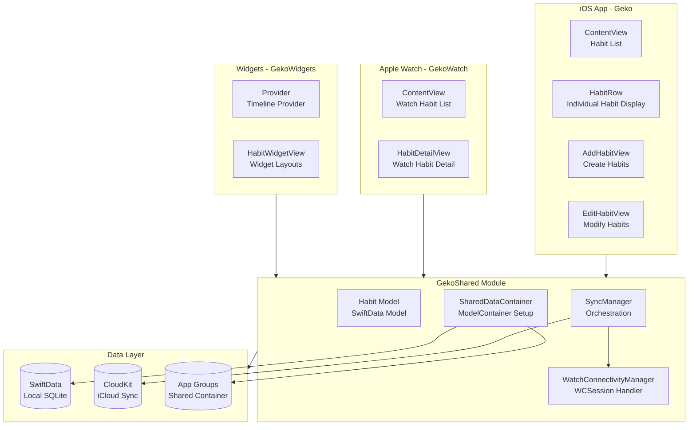
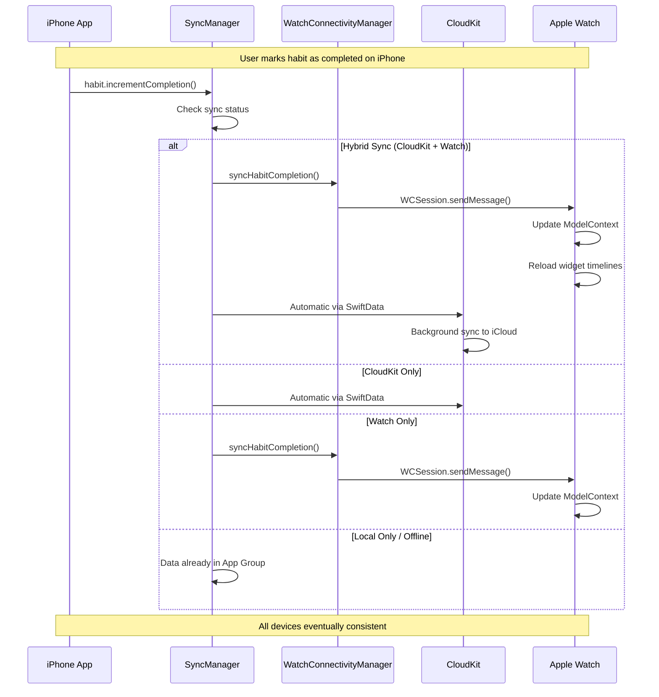

# Geko Architecture

This document provides a comprehensive overview of Geko's system design, data flows, and architectural decisions.

## Table of Contents

- [System Overview](#system-overview)
- [Architecture Diagram](#architecture-diagram)
- [Data Model](#data-model)
- [Sync Architecture](#sync-architecture)
- [Multi-Target Structure](#multi-target-structure)
- [Key Design Decisions](#key-design-decisions)

## System Overview

Geko is a native iOS/watchOS habit tracking application built with SwiftUI and SwiftData. The architecture is designed around three core principles:

1. **Modular Design** - Shared business logic in `GekoShared` enables code reuse across all targets
2. **Multi-Device Sync** - Hybrid sync strategy combining CloudKit and Watch Connectivity for optimal user experience
3. **Offline-First** - App Groups provide local data sharing with graceful degradation when network services are unavailable

## Architecture Diagram

### High-Level Component Architecture



### Sync Flow Architecture



## Data Model

### Habit Model

The `Habit` class is the core data model, defined as a SwiftData `@Model`:

```swift
@Model
public final class Habit {
    // Identity
    public var name: String
    public var emoji: String
    public var color: HabitColor
    
    // Completion tracking
    public var dailyTarget: Int              // How many times per day
    private var completedDaysStorage: [String]  // ISO-8601 date strings
    public var dailyCompletionCounts: [String: Int]  // For dailyTarget > 1
    
    // Reminders
    public var remindersEnabled: Bool
    public var reminderTimes: [Date]
    public var reminderMessage: String?
}
```

**Key Implementation Details:**

- **Date Storage:** Uses ISO-8601 format `"YYYY-MM-DD"` for date keys
- **Dual Completion Tracking:**
  - Simple habits (dailyTarget = 1): Uses `completedDaysStorage` set
  - Multi-target habits (dailyTarget > 1): Uses `dailyCompletionCounts` dictionary
- **Helper Methods:** `isoDay(for:in:)` normalizes dates to start of day for consistent key generation

### Completion Tracking Logic

```swift
// Check completion status
habit.completionCount(on: date)           // Returns current count (0 to dailyTarget)
habit.completionProgress(on: date)        // Returns 0.0 to 1.0
habit.isCompleted(on: date)               // Returns true if count >= dailyTarget
habit.isPartiallyCompleted(on: date)      // Returns true if 0 < count < dailyTarget

// Modify completion
habit.incrementCompletion(on: date)       // Increments count (up to dailyTarget)
habit.toggleCompleted(on: date)           // Toggles between 0 and full completion
habit.resetCompletion(on: date)           // Resets count to 0
```

## Sync Architecture

### Multi-Strategy Sync System

Geko implements a sophisticated hybrid sync strategy that combines three technologies:

1. **CloudKit** - Cross-device persistence and automatic conflict resolution
2. **Watch Connectivity** - Real-time iPhone ↔ Watch messaging when both active
3. **App Groups** - Local shared container for widget and Watch data access

### Sync Modes

The `SyncManager` detects available sync methods and operates in one of five modes:

| Mode | CloudKit | Watch Connectivity | Use Case |
|------|----------|-------------------|----------|
| `hybridSync` | ✅ | ✅ | Optimal: Real-time Watch updates + iCloud persistence |
| `cloudKitOnly` | ✅ | ❌ | Watch not reachable, but cross-device sync works |
| `watchOnly` | ❌ | ✅ | No iCloud, but real-time Watch sync available |
| `localOnly` | ❌ | ❌ | Offline with App Group sharing only |
| `offline` | ❌ | ❌ | No sync available (should not normally occur) |

### Sync Status Detection

```swift
// SyncManager.updateSyncStatus()
CKContainer.default().accountStatus { accountStatus, error in
    let isCloudKitAvailable = accountStatus == .available
    let isWatchConnectivityAvailable = WatchConnectivityManager.shared.isReachable
    
    switch (isCloudKitAvailable, isWatchConnectivityAvailable) {
    case (true, true):   syncStatus = .hybridSync
    case (true, false):  syncStatus = .cloudKitOnly
    case (false, true):  syncStatus = .watchOnly
    case (false, false): syncStatus = .localOnly
    }
}
```

### Sync Operations

All sync operations flow through `SyncManager`:

```swift
// Habit updates (name, emoji, color, etc.)
SyncManager.shared.syncHabitUpdate(habit)

// Completion toggles
SyncManager.shared.syncHabitCompletion(
    habitName: habit.name,
    date: date,
    isCompleted: habit.isCompleted(on: date),
    completionCount: habit.completionCount(on: date)
)

// Habit deletion
SyncManager.shared.syncHabitDeletion(
    habitName: habit.name,
    habitId: habitId
)

// Full sync request
SyncManager.shared.requestFullSync()
```

### Watch Connectivity Implementation

`WatchConnectivityManager` handles real-time messaging via `WCSession`:

**Message Types:**
- `"habitUpdate"` - Sends full habit data for creation/modification
- `"habitCompletion"` - Sends completion status change
- `"habitDeletion"` - Sends deletion instruction
- `"requestFullSync"` - Requests receiver to send all habits

**Key Features:**
- Checks `session.isReachable` before sending
- Uses `sendMessage(_:replyHandler:errorHandler:)` for immediate delivery
- Implements `WCSessionDelegate` to receive messages
- Updates local `ModelContext` when messages received
- Reloads widget timelines after data changes

## Multi-Target Structure

### Target Responsibilities

**Geko (iOS App)**
- Primary user interface
- Habit CRUD operations
- View mode switching (Weekly, Monthly, Yearly)
- Reminder management
- Search and filtering

**GekoWatch (Apple Watch App)**
- Simplified habit list view
- Quick completion tracking
- Syncs via Watch Connectivity + App Groups

**GekoWidgets (Widget Extension)**
- Home screen widgets (small, medium, accessory)
- Reads from shared ModelContainer
- Updates via `WidgetCenter.reloadAllTimelines()`
- Uses `AppIntentTimelineProvider` for configuration

**GekoShared (Shared Module)**
- Core data model (`Habit`)
- Sync logic (`SyncManager`, `WatchConnectivityManager`)
- Data container setup (`SharedDataContainer`)
- Reusable UI components (emoji picker, color picker, progress rings, etc.)

### App Groups Integration

All targets share data via App Group: `group.com.irenews.geko`

```swift
// SharedDataContainer.swift
public static let appGroupIdentifier = "group.com.irenews.geko"

private var sharedStoreURL: URL {
    let appGroupURL = FileManager.default.containerURL(
        forSecurityApplicationGroupIdentifier: Self.appGroupIdentifier
    )
    return appGroupURL.appendingPathComponent("Geko.sqlite")
}
```

**Benefits:**
- Widgets can read habit data without launching the app
- Watch app and iPhone app share the same local database
- Works offline without any network dependency
- Enables seamless data access across all targets

## Key Design Decisions

### 1. Modular Architecture with GekoShared

**Decision:** Extract all shared business logic and UI components into a separate `GekoShared` module.

**Rationale:**
- Eliminates code duplication across iOS app, Watch app, and widgets
- Ensures consistent behavior (e.g., date handling, completion logic)
- Single source of truth for data model
- Easier testing and maintenance

**Trade-offs:**
- Slightly more complex project structure
- All shared code must be properly exported as `public`

### 2. Hybrid Sync Strategy

**Decision:** Combine CloudKit (automatic via SwiftData) with Watch Connectivity (manual implementation) instead of relying on a single sync method.

**Rationale:**
- **Best of both worlds:** CloudKit provides reliable cross-device persistence; Watch Connectivity provides instant responsiveness
- **Resilience:** Graceful degradation when only one sync method available
- **Offline support:** App Groups enable local sharing even when network unavailable
- **User experience:** Users see immediate updates on paired Watch without waiting for CloudKit sync

**Trade-offs:**
- More complex sync logic
- Must maintain both CloudKit schema and Watch Connectivity message protocol
- Potential for sync conflicts (mitigated by treating iCloud as source of truth)

### 3. Dictionary-Based Completion Storage

**Decision:** Store completions using ISO-8601 date strings as keys in dictionaries rather than separate SwiftData entities.

**Rationale:**
- **Performance:** No need to query separate completion entities
- **Simplicity:** Completion data co-located with habit data
- **Flexibility:** Easy to query by date without complex SwiftData predicates
- **CloudKit-friendly:** Dictionaries sync well with CloudKit

**Trade-offs:**
- No separate completion history entity (could add later if needed)
- Dictionary keys are strings rather than Date objects (requires conversion)

### 4. Dual Completion Tracking Systems

**Decision:** Use `completedDaysStorage` array for simple habits (dailyTarget = 1) and `dailyCompletionCounts` dictionary for multi-target habits.

**Rationale:**
- **Backward compatibility:** Existing simple habits continue using set-based storage
- **Optimization:** Simple habits don't need count tracking overhead
- **Flexibility:** Multi-target habits get proper count support

**Trade-offs:**
- Two code paths for completion tracking
- Slightly more complex logic in completion methods

### 5. App Groups for Local Data Sharing

**Decision:** Use App Groups instead of separate databases or XPC for sharing data between app, widgets, and Watch app.

**Rationale:**
- **Native iOS feature:** No custom IPC implementation needed
- **Performance:** Direct SQLite database access
- **Reliability:** No network dependency for local sharing
- **Simplicity:** All targets read/write same database file

**Trade-offs:**
- All targets must have App Group entitlement configured
- Care needed to avoid concurrent write conflicts (mitigated by SwiftData's actor model)

### 6. SwiftData with CloudKit Fallback

**Decision:** Attempt CloudKit configuration first, gracefully fall back to local-only if CloudKit unavailable.

**Rationale:**
- **User experience:** App works even if user not signed into iCloud
- **Development:** App can be tested without Apple Developer account CloudKit setup
- **Robustness:** Handles CloudKit configuration errors gracefully

**Implementation:**
```swift
// Try CloudKit first
do {
    modelConfiguration = ModelConfiguration(
        schema: schema,
        url: sharedStoreURL,
        cloudKitDatabase: .automatic
    )
    return try ModelContainer(for: schema, configurations: [modelConfiguration])
} catch {
    // Fall back to local-only
    let localConfiguration = ModelConfiguration(
        schema: schema,
        url: sharedStoreURL,
        cloudKitDatabase: .none
    )
    return try ModelContainer(for: schema, configurations: [localConfiguration])
}
```

### 7. Widget Timeline Management

**Decision:** Manually reload widget timelines after data changes rather than relying on automatic updates.

**Rationale:**
- **Responsiveness:** Widgets update immediately after completion/changes
- **Control:** Explicit update triggers prevent stale widget data
- **Predictability:** Know exactly when widgets refresh

**Implementation:**
```swift
// Called after sync operations
WidgetCenter.shared.reloadAllTimelines()
```

**Trade-offs:**
- Must remember to call reload after data changes
- Could be optimized to reload only affected widget (but reloading all is simpler)

## View Mode Architecture

Geko supports three view modes for displaying habit progress:

- **Weekly:** Rolling 7-day window showing recent completions
- **Monthly:** Calendar grid for current month
- **Yearly:** 53-week grid showing entire year at a glance

**Implementation:**
- `ViewMode` enum in `GekoShared/ViewMode.swift`
- Separate summary components: `WeekSummary.swift`, `MonthSummary.swift`, `YearSummary.swift`
- Mode persisted via `@AppStorage("lastSelectedViewMode")`
- `HabitRow` conditionally renders appropriate summary component

## Reminder System

Reminders use iOS/watchOS `UserNotifications` framework:

1. **Permission:** Request authorization on first reminder enable
2. **Scheduling:** Uses `UNCalendarNotificationTrigger` for daily repeating notifications
3. **Identifiers:** Unique per habit and reminder time: `"{name}-{emoji}-reminder-{index}"`
4. **Updates:** Cancels existing and reschedules when reminder settings change

**Key Methods:**
- `habit.scheduleReminders()` - Async method to request permission and schedule
- `habit.cancelReminders()` - Removes pending notifications
- `habit.updateReminders()` - Handles changes (schedule if enabled, cancel if disabled)

## Performance Considerations

- **SwiftUI @Query:** Automatic updates when SwiftData changes
- **Lazy loading:** Widget timelines only load necessary data
- **Efficient date keys:** ISO-8601 strings enable fast dictionary lookups
- **Watch Connectivity:** Only sends when `isReachable` to avoid wasted effort
- **App Group SQLite:** Single shared database eliminates sync overhead for local access

## Security Considerations

- **CloudKit:** Automatic encryption in transit and at rest
- **App Groups:** Sandboxed to app family, not accessible by other apps
- **Reminders:** Permission requested, notifications only to authorized devices
- **No external dependencies:** Reduced attack surface

## Future Extensibility

The architecture supports future enhancements:

- **Additional sync methods:** Easy to add (e.g., family sharing, third-party sync)
- **New data models:** SwiftData schema migrations supported
- **Habit categories/tags:** Dictionary or separate entity could be added
- **Analytics:** Completion data already structured for aggregation
- **Export/import:** ISO-8601 dates and dictionaries are serialization-friendly

---

For API details, see [API.md](API.md).
